# **Customer Segmentation Analysis — RFM + K-Means Clustering**

<p align="center">
  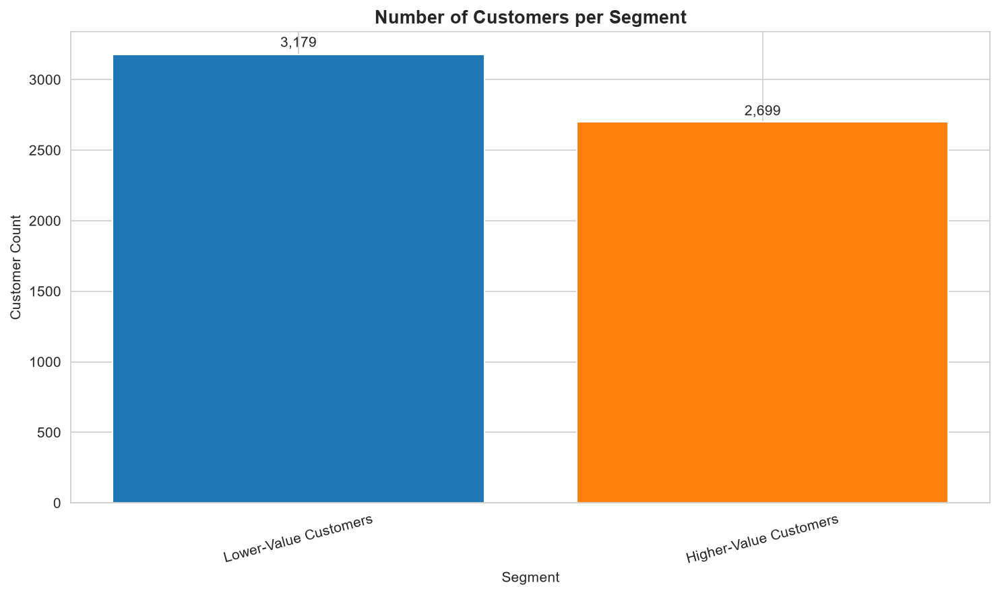
</p>

<p align="center">
  
  
  
  
  
  
</p>

<p align="center">
  <b>Level 1 · Task 2</b> — Segmenting 5,878 real customers from 779,425 transactions
  into behavioural groups using RFM feature engineering and K-Means clustering,
  validated with the Elbow Method and Silhouette Score.
</p>

---

## 📌 Table of Contents

- [Overview](#-overview)
- [Dataset](#-dataset)
- [Project Structure](#-project-structure)
- [Tech Stack](#-tech-stack)
- [Methodology](#-methodology)
- [Key Findings](#-key-findings)
- [Visual Analysis](#-visual-analysis)
- [Segment Profiles](#-segment-profiles)
- [Marketing Recommendations](#-marketing-recommendations)
- [Limitations](#-limitations)
- [How to Run](#-how-to-run)
- [Author](#-author)

---

## 🔍 Overview

This project applies **RFM (Recency, Frequency, Monetary) analysis** and
**K-Means clustering** to real transactional data from a UK-based online retailer,
covering the period **December 2009 to December 2011**. The goal is to move beyond
a single "average customer" view and identify distinct, actionable behavioural
segments that can each receive a tailored marketing strategy.

The pipeline was built end-to-end: raw transaction ingestion → data quality
validation and cleaning → exploratory analysis → RFM feature construction →
standardization → K-Means clustering (K chosen via Elbow Method and Silhouette
Score) → cluster visualization → segment profiling → business recommendations.

**At a glance:**

| Metric | Value |
|---|---|
| Raw Transactions Loaded | 1,067,371 |
| Valid Transactions After Cleaning | 779,425 (73.0% retained) |
| Unique Customers Analyzed | 5,878 |
| Total Revenue Represented | £17,374,804.25 |
| Final Number of Segments (K) | 2 |
| Final Silhouette Score | 0.4187 |

---

## 🗂 Dataset

**Name:** Online Retail II (UCI)
**Source:** [Kaggle — mashlyn/online-retail-ii-uci](https://www.kaggle.com/datasets/mashlyn/online-retail-ii-uci)
**File:** `online_retail_II.csv`
**Coverage:** December 2009 – December 2011, UK-based online retailer, 38+ countries

| Column | Description |
|---|---|
| `InvoiceNo` | Unique transaction/invoice identifier (prefix `C` = cancellation) |
| `StockCode` | Product code |
| `Description` | Product name |
| `Quantity` | Units purchased |
| `InvoiceDate` | Date and time of transaction |
| `UnitPrice` | Price per unit |
| `CustomerID` | Unique customer identifier |
| `Country` | Customer's country |

### Data Quality — What Was Actually Found

The raw file was inspected before any assumptions were made:

- **1,067,371** raw transaction rows across 8 columns
- **22.77%** of rows were missing a `CustomerID` — these cannot be attributed to any
  customer and were excluded from segmentation
- **34,335** exact duplicate rows
- **22,950** rows with `Quantity ≤ 0` (returns/cancellations)
- **6,207** rows with `UnitPrice ≤ 0` (invalid entries)

After cleaning, **779,425 valid, attributable transactions** remained — **73.0%** of
the original volume — across **5,878 unique customers**.

---

## 📁 Project Structure

```
DataAnalytics-L1-CustomerSegmentation/
│
├── data/
│   ├── raw/
│   │   └── online_retail_II.csv               # Original, untouched source file
│   └── processed/
│       ├── cleaned_transactions.csv           # Post-cleaning transaction table
│       ├── rfm_table.csv                      # Per-customer RFM features
│       └── rfm_clustered.csv                  # Final labeled dataset with segments
│
├── notebooks/
│   └── customer_segmentation_analysis.ipynb   # Full phase-by-phase analysis
│
├── outputs/
│   ├── figures/                               # 12+ exported analysis charts
│   └── Segmentation_Summary_Report.md         # Auto-generated metrics + findings
│
├── screenshots/                               # Proof-of-work for internship submission
└── README.md
```

---

## 🛠 Tech Stack

| Tool | Purpose |
|---|---|
| **Python 3.10+** | Core language |
| **pandas / numpy** | Data loading, cleaning, aggregation |
| **scikit-learn** | `StandardScaler`, `KMeans`, `silhouette_score` |
| **matplotlib / seaborn** | Statistical visualization |
| **Jupyter Notebook** | Interactive, phase-by-phase analysis |

---

## 🧭 Methodology

The analysis followed eleven structured phases, each validated with printed
diagnostics before moving forward:

1. **Data Acquisition & Structural Inspection** — shape, dtypes, nulls, duplicates
2. **Data Cleaning & Consistency Handling** — cancellations, invalid values, missing IDs removed
3. **Exploratory Data Analysis** — spend/frequency distributions, monthly volume trends
4. **RFM Feature Construction** — Recency, Frequency, Monetary per customer, with a
   documented log-transform decision for skewed features
5. **Standardization** — `StandardScaler` applied to Recency and log-transformed
   Frequency/Monetary
6. **K-Means Clustering & Elbow Method** — tested K = 1 to 10, validated with
   Silhouette Score across K = 2 to 10
7. **Cluster Visualization** — scatter plots across all RFM feature pairs + pairplot
8. **Cluster Profiling** — mean R/F/M per cluster, ranked and named by behavioural strength
9. **Cluster Size Visualization** — customer distribution across segments
10. **Insights & Marketing Recommendations** — segment-specific action plans
11. **Final Packaging & Export** — figure/file verification, cleaned exports

---

## 📊 Key Findings

- **Customer spend is heavily right-skewed** — mean spend of £2,955.90 sits well
  above the median of £867.74, confirming a small group of high-value customers
  pulls the average upward relative to the typical customer.
- **27.6% of customers (1,623 people) have purchased only once**, marking a
  substantial low-engagement population that shows up clearly in the final clustering.
- **November 2011 was the peak transaction month**, with 63,168 transactions —
  useful context for interpreting Recency values near the snapshot date.
- **The Elbow Method and Silhouette Score converged on K = 2**, the highest-scoring
  option (silhouette = 0.4187) across every K tested from 2 to 10 — meaning this
  customer base splits most naturally into two clearly separated behavioural groups
  rather than several finer-grained ones.
- **The two segments differ dramatically**: the higher-value group orders roughly
  **6× more often** and spends over **11× more** on average than the lower-value
  group, while returning to purchase roughly **5× more recently**.

Full computed metrics and the complete phase-by-phase execution log are available in
[`outputs/Segmentation_Summary_Report.md`](outputs/Segmentation_Summary_Report.md).

---

## 🖼 Visual Analysis

### Exploratory Data Analysis
<p align="center">
  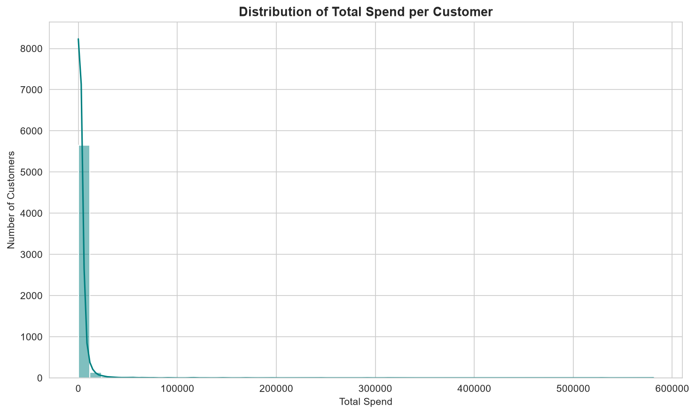
  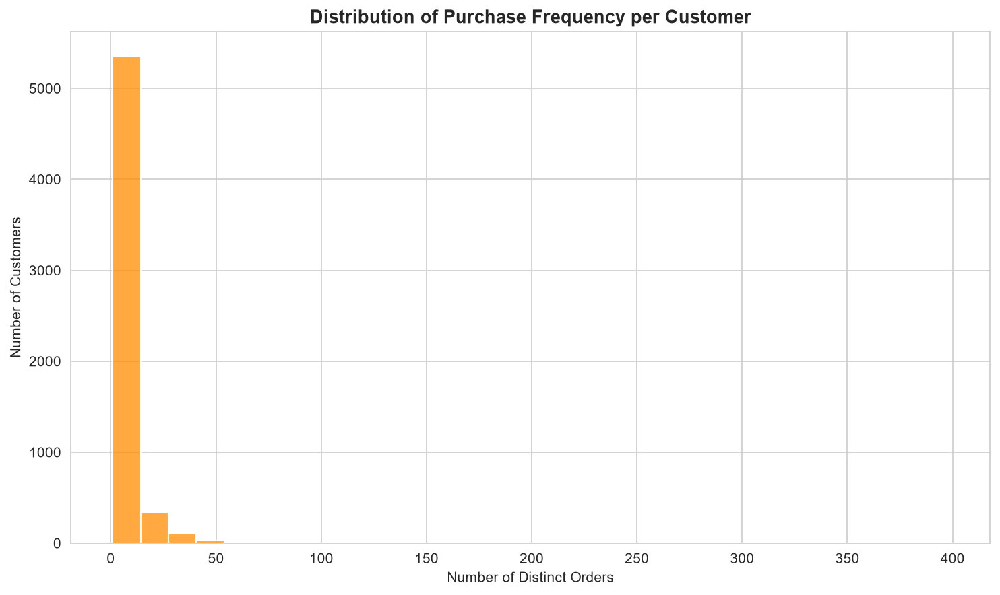
</p>

<p align="center">
  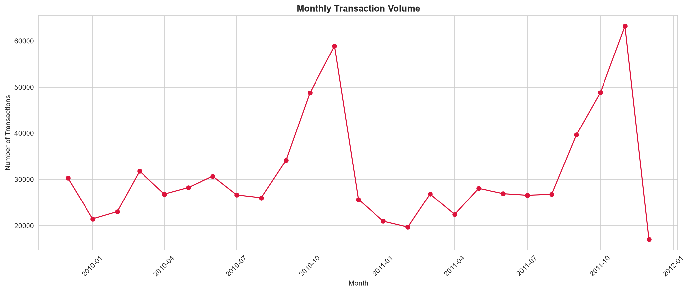
</p>

Spend and purchase frequency both show the classic right-skewed shape typical of
retail customer bases — most customers cluster at lower values while a smaller tail
of high-value, high-frequency buyers extends the distribution.

---

### RFM Feature Distributions
<p align="center">
  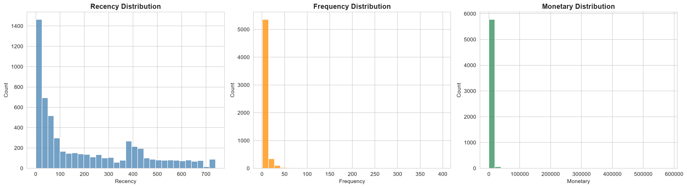
  <br><em>Raw Recency, Frequency, and Monetary distributions</em>
</p>

<p align="center">
  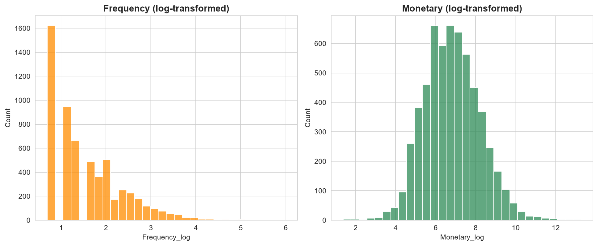
  <br><em>Log-transformed Frequency and Monetary — used specifically for clustering input</em>
</p>

---

### Choosing K — Elbow Method & Silhouette Score
<p align="center">
  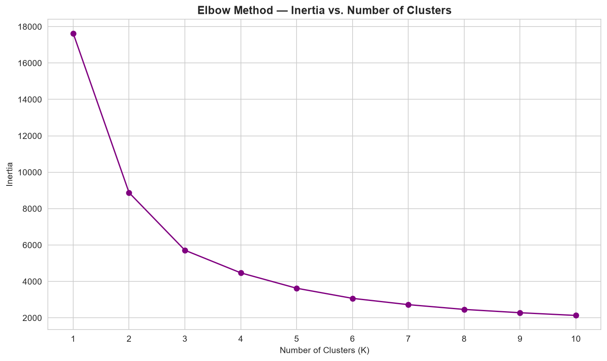
  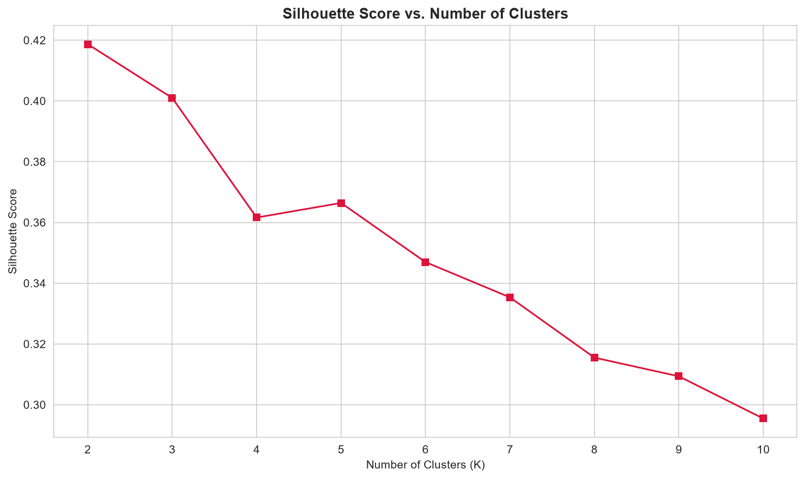
</p>

Both diagnostics were used together rather than relying on the elbow curve alone.
The silhouette score peaked decisively at **K = 2 (score = 0.4187)**, indicating this
dataset separates most cleanly into two well-defined groups rather than several
overlapping ones.

---

### Cluster Visualization
<p align="center">
  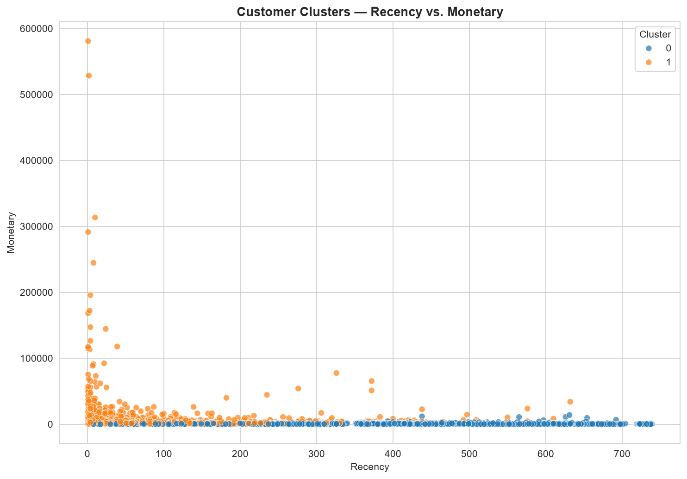
  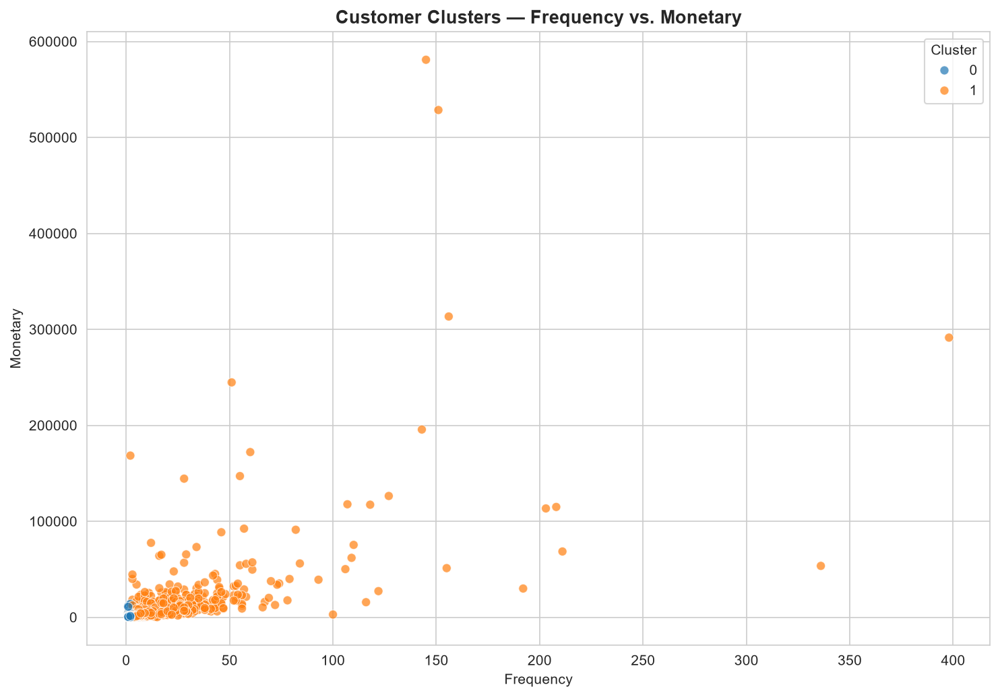
</p>

<p align="center">
  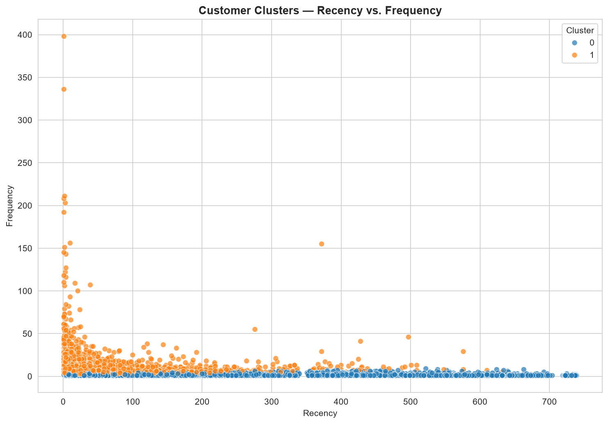
</p>

<p align="center">
  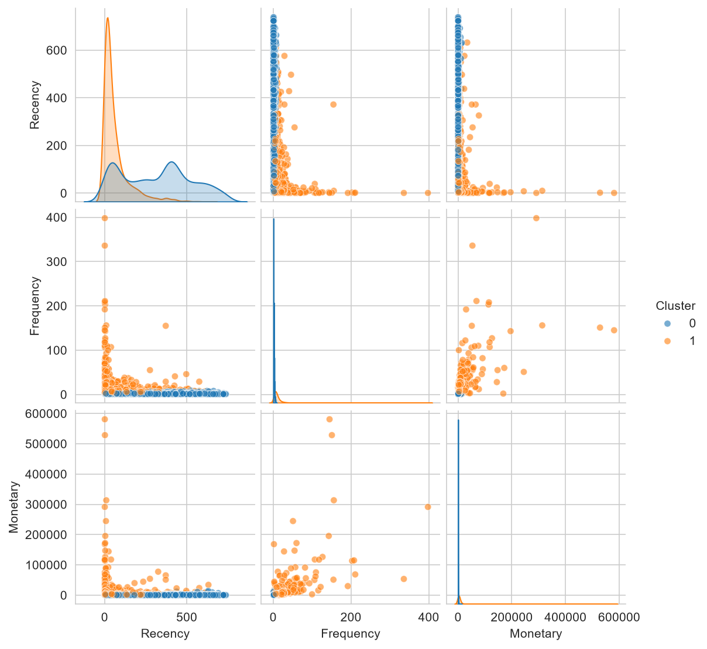
  <br><em>Combined pairwise view across all three RFM dimensions</em>
</p>

Across every feature-pair combination, the two clusters show clear, consistent
separation — customers with low Recency and high Frequency/Monetary form one tight
group, while high-Recency, low-Frequency customers form the other.

---

## 👥 Segment Profiles

| Segment | Customers | % of Base | Avg. Recency | Avg. Frequency | Avg. Monetary |
|---|---:|---:|---:|---:|---:|
| **Higher-Value Customers** | 2,699 | 45.9% | 63.95 days | 11.52 orders | £5,822.97 |
| **Lower-Value Customers** | 3,179 | 54.1% | 317.97 days | 1.85 orders | £521.74 |

**Higher-Value Customers** — Nearly half the customer base, this segment purchased
recently (roughly 2 months ago on average), orders frequently (over 11 distinct
orders on average), and carries a substantially higher average spend. This is the
core revenue-driving segment.

**Lower-Value Customers** — The slight majority of the base by count, this segment
has not purchased in nearly a year on average, has typically ordered only once or
twice, and contributes far less average revenue per customer. This group likely
overlaps heavily with the one-time-buyer population identified during EDA
(27.6% of all customers).

---

## 💡 Marketing Recommendations

1. **Protect and grow the Higher-Value Customers segment (2,699 customers, 45.9% of
   base).** With an average spend of £5,822.97 and 11.5 orders per customer, this
   group already represents the strongest commercial relationship. Prioritize
   retention: personalized outreach, loyalty tiering, and early access to new
   product lines to defend this segment against competitor churn.

2. **Run a structured win-back campaign for Lower-Value Customers (3,179 customers,
   54.1% of base).** With an average Recency of 318 days, this group is close to
   fully disengaged. A time-limited discount or "we miss you" campaign is the
   correct urgency level — a low-cost, automated re-engagement email sequence is
   more appropriate here than high-touch outreach given the lower average spend.

3. **Investigate the one-time-buyer population specifically (27.6% of all
   customers, identified in Phase 3).** Since this population likely overlaps
   heavily with the Lower-Value segment, a first-repeat-purchase incentive
   targeted at recent first-time buyers could convert a portion of this group into
   the Higher-Value segment before their Recency grows too large.

4. **Treat K = 2 as the current ground truth, not a ceiling.** The Silhouette Score
   analysis showed two segments are the most *statistically distinct* grouping for
   this dataset — but distinct is not the same as *maximally useful* for every
   marketing use case. See Next Steps below for how to explore finer segmentation
   within the Higher-Value group specifically.

---

## ⚠️ Limitations

- **Only two segments emerged as statistically optimal.** While K = 2 was the
  strongest result by Silhouette Score across all tested values, this is a coarser
  segmentation than the four-to-five segment structure common in RFM case studies.
  This reflects what the data actually supports, not an assumption carried in from
  the original plan.
- **RFM here does not account for product category.** Two customers with identical
  R/F/M values could have entirely different purchasing interests, so this
  segmentation should inform retention/re-engagement strategy, not product-specific
  targeting, without further feature engineering.
- **Recency is anchored to a fixed snapshot date (2011-12-10).** Re-running this
  analysis at a later date will shift every customer's Recency value and may change
  cluster boundaries — this segmentation is a point-in-time snapshot.
- **The dataset is UK-dominant** by nature of the source retailer; segment behavior
  may not generalize to markets with different purchasing patterns without
  independent validation.
- **One-time buyers (27.6% of customers) provide limited behavioural signal** — a
  single transaction constrains how precisely their long-term behavior can be
  characterized compared to repeat customers.

### Next Steps

- Re-run K-Means restricted to the Higher-Value Customers segment alone, to check
  whether a finer sub-segmentation (e.g. distinguishing "Champions" from
  "Consistently Loyal") is statistically supported within that group specifically.
- Incorporate `StockCode`/`Description` category data to enable product-specific
  targeting layered on top of the existing R/F/M segments.
- Compare this K-Means result against hierarchical clustering or DBSCAN to confirm
  the two-segment structure holds across different clustering methods.
- Re-run this pipeline on a recurring basis (e.g. quarterly) to track how individual
  customers migrate between segments over time — a stronger retention signal than
  a single static snapshot.

---

## ▶️ How to Run

**1. Clone the repository**
```bash
git clone https://github.com/<your-username>/DataAnalytics-L1-CustomerSegmentation.git
cd DataAnalytics-L1-CustomerSegmentation
```

**2. Set up the environment**
```bash
python -m venv venv
venv\Scripts\activate        # Windows
# source venv/bin/activate   # macOS/Linux

pip install pandas numpy scikit-learn matplotlib seaborn jupyter tabulate
```

**3. Add the dataset**

Download `online_retail_II.csv` from the
[Kaggle dataset page](https://www.kaggle.com/datasets/mashlyn/online-retail-ii-uci)
and place it in `data/raw/`.

**4. Run the analysis**
```bash
jupyter notebook notebooks/customer_segmentation_analysis.ipynb
```
Run all cells in order (Phase 0 → Phase 11). Charts save automatically to
`outputs/figures/`, and the final summary report is written to
`outputs/Segmentation_Summary_Report.md`.

---

<details>
<summary>📈 Click to preview a recorded run-through of the notebook execution</summary>
<br>

> Add a short screen recording (`.gif` or `.mp4`) of the notebook running end-to-end
> here — e.g. using <a href="https://www.screentogif.com/">ScreenToGif</a> or
> <a href="https://getkap.co/">Kap</a> — and reference it as:
> ``

</details>

---

## 👤 Author

**Data Analytics Track — Level 1, Task 2**
Customer Segmentation (RFM + K-Means) · Built as part of an end-to-end data
analytics internship project track.

If this project was useful or informative, consider ⭐ starring the repository.