# 🛍️ Retail Sales EDA — Customer Shopping Dataset

<p align="center">
  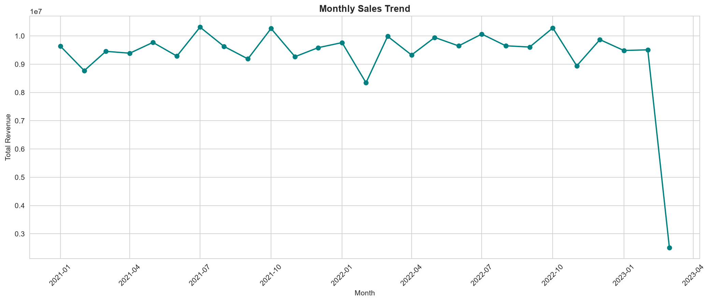
</p>

<p align="center">
  
  
  
  
  
</p>

<p align="center">
  <b>Level 1 · Task 1</b> — End-to-end Exploratory Data Analysis on 99,457 retail transactions
  across 10 shopping malls in Istanbul, uncovering revenue drivers, customer demographics,
  and location-level purchasing patterns.
</p>

---

## 📌 Table of Contents

- [Overview](#-overview)
- [Dataset](#-dataset)
- [Project Structure](#-project-structure)
- [Tech Stack](#-tech-stack)
- [Methodology](#-methodology)
- [Key Findings](#-key-findings)
- [Visual Analysis](#-visual-analysis)
- [Business Recommendations](#-business-recommendations)
- [How to Run](#-how-to-run)
- [Sample Output](#-sample-output)
- [Author](#-author)

---

## 🔍 Overview

This project delivers a complete exploratory data analysis on transactional retail data
sourced from ten shopping malls in Istanbul, spanning **January 2021 to March 2023**.
The analysis moves through data validation, feature engineering, statistical profiling,
time series decomposition, demographic segmentation, product performance, correlation
testing, and location-level insight discovery — closing with data-backed business
recommendations.

The full pipeline was executed in a structured, reproducible notebook and mirrored in a
standalone script that regenerates every chart and the summary report from the raw CSV
in a single run.

**At a glance:**

| Metric | Value |
|---|---|
| Total Transactions | 99,457 |
| Total Revenue | ₺251,505,794.25 |
| Average Transaction Value | ₺2,528.79 |
| Date Range | 2021-01-01 → 2023-03-08 |
| Malls Covered | 10 |
| Product Categories | 8 |

---

## 🗂 Dataset

**Name:** Customer Shopping Dataset (Istanbul Malls)
**Source:** [Kaggle — mehmettahiraslan/customer-shopping-dataset](https://www.kaggle.com/datasets/mehmettahiraslan/customer-shopping-dataset)
**File:** `customer_shopping_data.csv`
**Shape:** 99,457 rows × 10 raw columns (expanded to 17 after feature engineering)

| Column | Description |
|---|---|
| `invoice_no` | Unique transaction identifier |
| `customer_id` | Unique customer identifier |
| `gender` | Customer gender |
| `age` | Customer age |
| `category` | Product category purchased |
| `quantity` | Units purchased in the transaction |
| `price` | Price per unit |
| `payment_method` | Cash / Credit Card / Debit Card |
| `invoice_date` | Transaction date |
| `shopping_mall` | Mall location of purchase |

Data quality was verified prior to analysis: **zero missing values** and **zero duplicate
records** were found across all 99,457 rows.

---

## 📁 Project Structure

```
DataAnalytics-L1-EDARetailSales/
│
├── data/
│   ├── raw/
│   │   └── customer_shopping_data.csv        # Original, untouched source file
│   └── processed/
│       ├── cleaned_shopping_data.csv         # Post Phase 1-2 cleaning
│       └── final_analyzed_dataset.csv        # Fully feature-engineered dataset
│
├── notebooks/
│   └── 01_eda_retail_sales.ipynb             # Full phase-by-phase analysis
│
├── outputs/
│   ├── figures/                              # 14 exported analysis charts
│   └── EDA_Summary_Report.md                 # Auto-generated metrics + findings
│
├── src/
│   ├── __init__.py
│   ├── data_loader.py                        # Reusable load/clean/save functions
│   └── viz_helpers.py                        # Reusable plotting functions
│
├── screenshots/                              # Notebook execution screenshots
└── README.md
```

---

## 🛠 Tech Stack

| Tool | Purpose |
|---|---|
| **Python 3.10+** | Core language |
| **pandas** | Data loading, cleaning, aggregation |
| **numpy** | Numerical computation |
| **matplotlib** | Base plotting engine |
| **seaborn** | Statistical visualization |
| **Jupyter Notebook** | Interactive, phase-by-phase analysis |

---

## 🧭 Methodology

The analysis was executed across nine structured phases, each validated with printed
diagnostics before moving to the next:

1. **Data Loading & Initial Inspection** — shape, dtypes, null and duplicate checks
2. **Data Cleaning & Feature Engineering** — datetime conversion, `total_amount`,
   `age_group`, and calendar fields derived
3. **Descriptive Statistics** — mean, median, mode, std, and IQR outlier checks
4. **Time Series Analysis** — monthly and quarterly revenue trend decomposition
5. **Customer Demographics** — age and gender distribution, spend comparison
6. **Product / Category Analysis** — revenue and volume ranking by category
7. **Correlation Analysis** — relationship testing across numeric variables
8. **Non-Obvious Insight** — mall-level revenue and category concentration
9. **Consolidated Summary** — key metrics rollup and business recommendations

---

## 📊 Key Findings

- **Clothing is the dominant category**, leading every single mall in the dataset both
  by revenue (₺113,996,791.04) and transaction volume (34,487 transactions) — no mall
  shows a different top category.
- **Mall of Istanbul is the top-performing location**, generating ₺50,872,481.68 in
  total revenue, ahead of all nine other malls.
- **The 35–44 age group drives the most total revenue** of any age bracket, making it
  the primary commercial segment despite a broad overall age spread (mean age 43.4).
- **Gender split leans female** (59,482 vs. 39,975 transactions), but average spend per
  transaction is nearly identical between genders (₺2,525.25 vs. ₺2,534.05) — the gap is
  in frequency, not basket size.
- **Price is the dominant driver of transaction value** — price and `total_amount` show
  a strong positive correlation (r = 0.962), while age shows negligible correlation with
  spend, quantity, or price.
- **July 2021 was the strongest month** (₺10,311,119.68) and **Q3 2022 the strongest
  quarter** (₺29,326,937.83); March 2023 recorded the lowest monthly revenue, aligning
  with the dataset's partial final period.

Full computed metrics and the phase-by-phase execution log are available in
[`outputs/EDA_Summary_Report.md`](outputs/EDA_Summary_Report.md).

---

## 🖼 Visual Analysis

### Descriptive Statistics
<p align="center">
  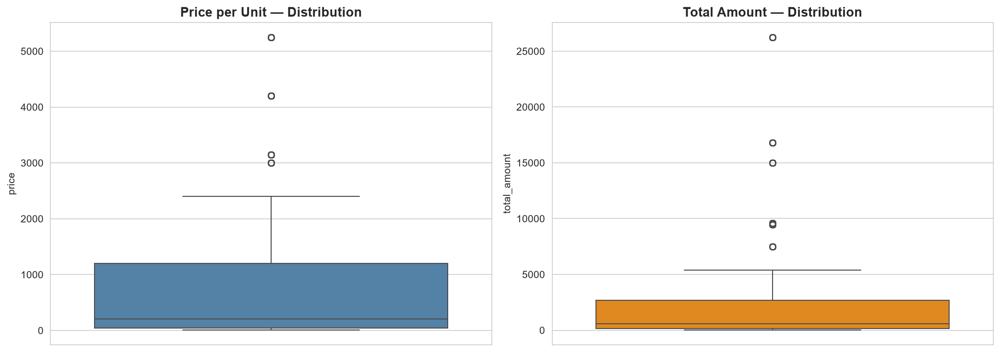
</p>

Price and total transaction value both show wide, right-skewed spread — a direct result
of the mix between low-cost categories (Books, Food & Beverage) and high-cost categories
(Clothing, Technology), rather than a data quality issue.

---

### Time Series Trends
<p align="center">
  
  <br><em>Monthly Sales Trend</em>
</p>

<p align="center">
  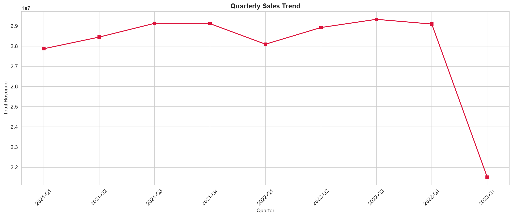
  <br><em>Quarterly Sales Trend</em>
</p>

Revenue holds within a relatively stable band across the recorded period rather than
showing sharp seasonal spikes, with Q3 2022 standing out as the strongest quarter overall.

---

### Customer Demographics
<p align="center">
  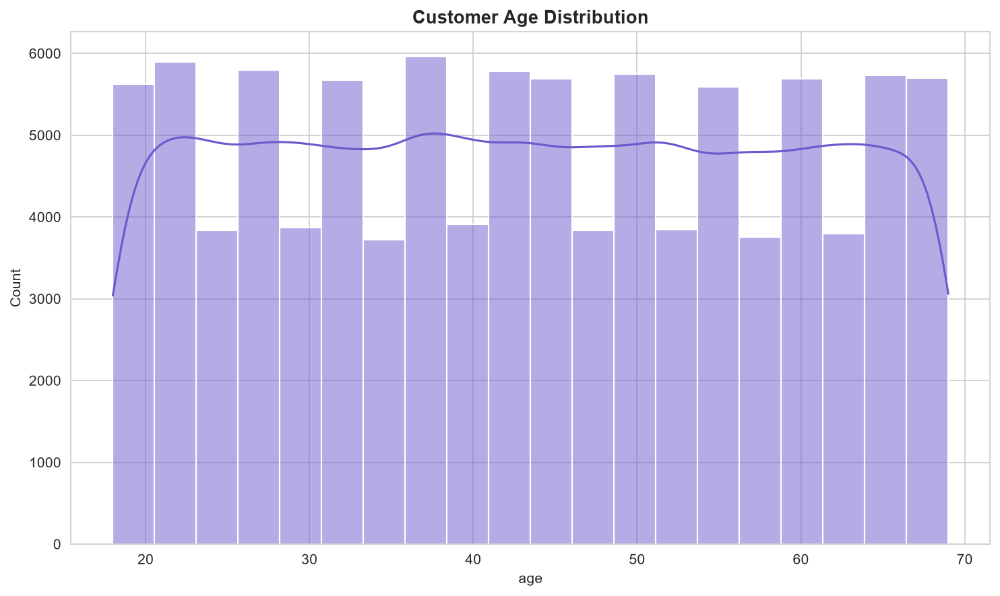
  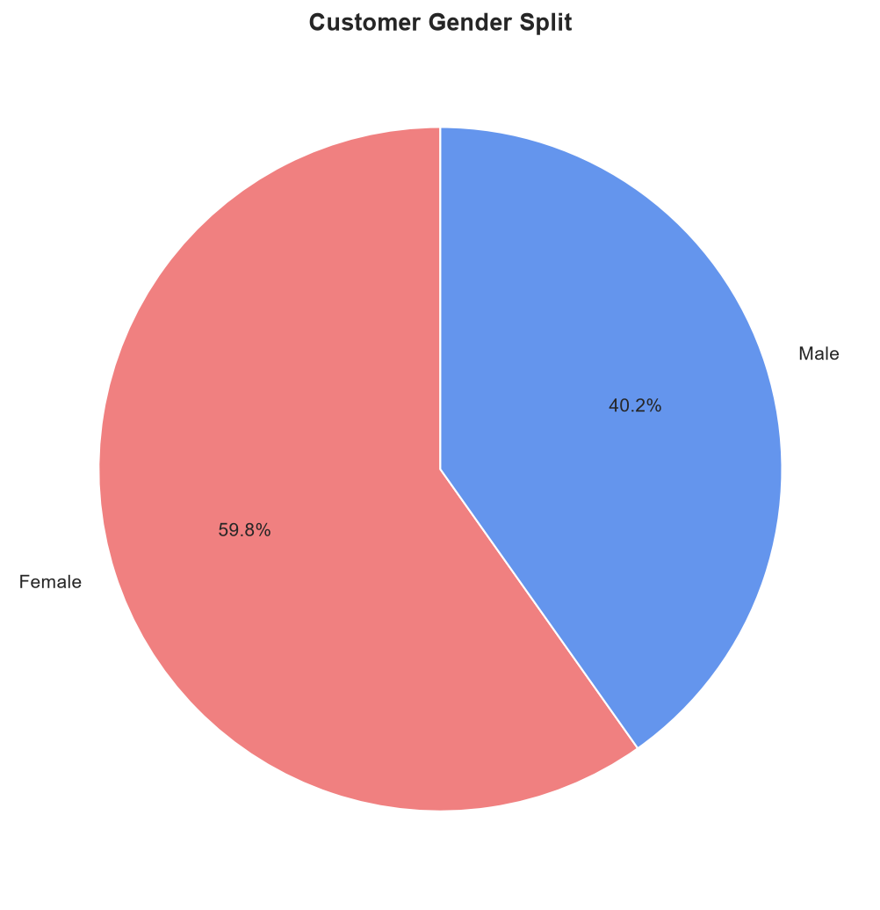
</p>

<p align="center">
  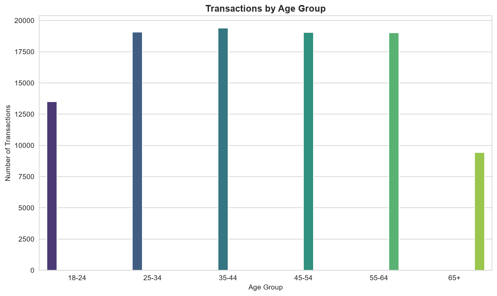
</p>

The customer base skews toward a broad adult age range with no single dominant bracket,
though the 35–44 group leads in total contribution to revenue.

---

### Product & Category Performance
<p align="center">
  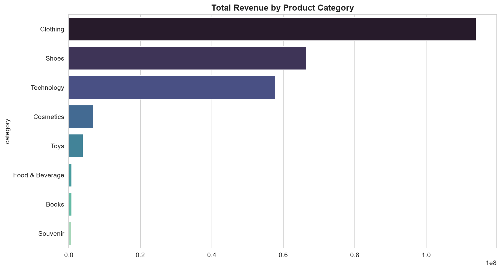
</p>

<p align="center">
  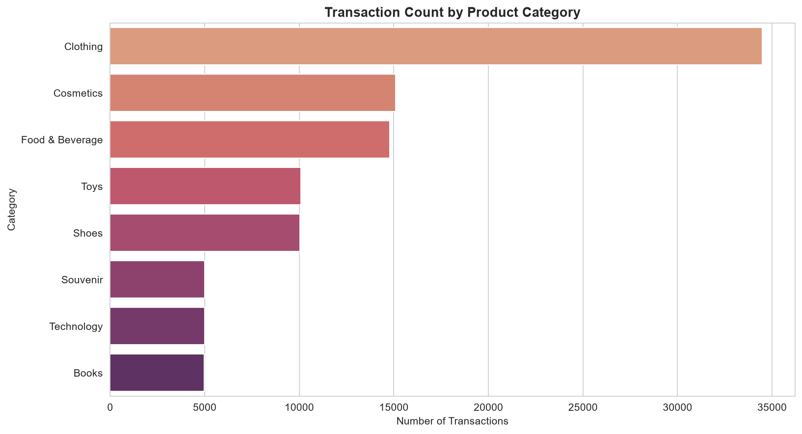
  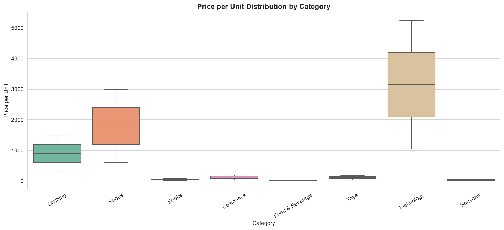
</p>

Clothing leads decisively on both revenue and volume, while price distributions per
category confirm that premium categories (Technology, Clothing) carry both higher
prices and wider price variance than staple categories.

---

### Correlation Analysis
<p align="center">
  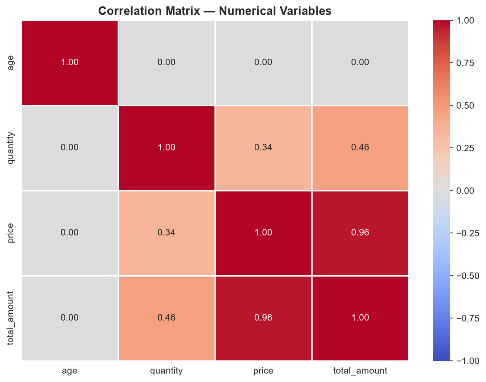
  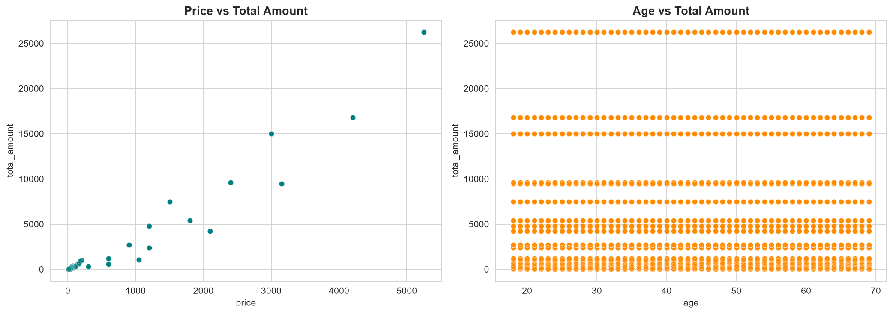
</p>

Price is the strongest driver of total transaction value (r = 0.962). Age shows no
meaningful linear relationship with any numeric field, reinforcing that spend behavior
here is category- and price-driven rather than age-driven.

---

### Non-Obvious Insight — Mall-Level Patterns
<p align="center">
  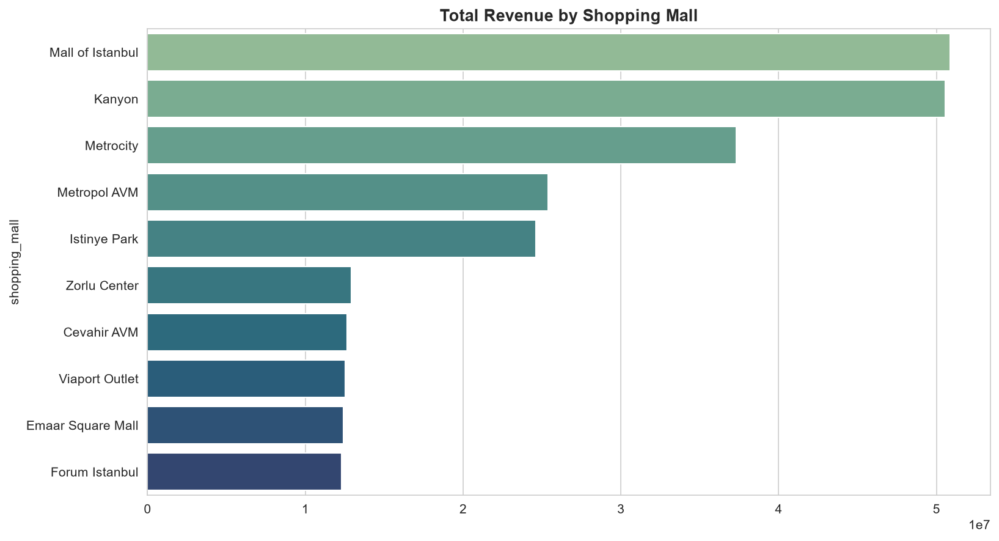
</p>

<p align="center">
  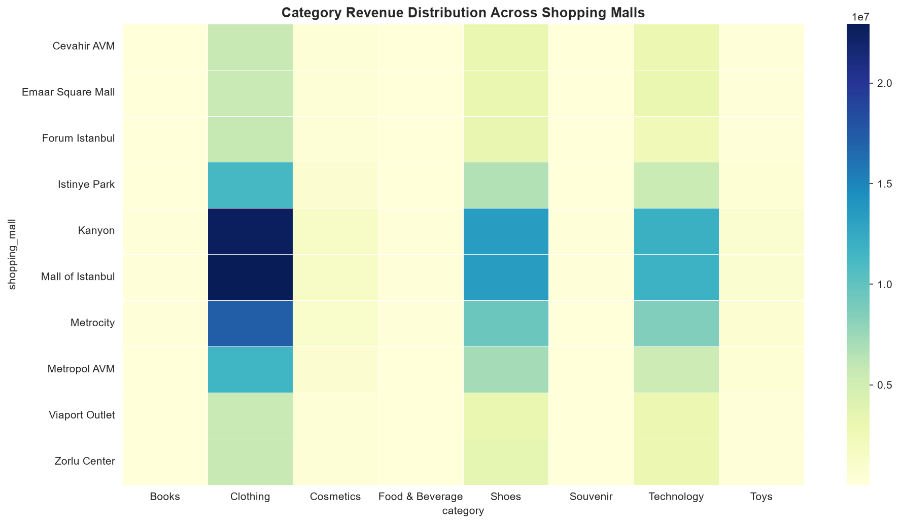
  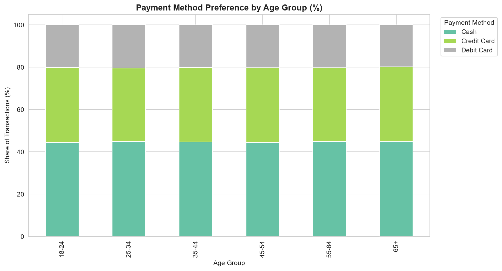
</p>

Mall of Istanbul leads all locations in total revenue. Interestingly, Clothing dominates
as the top category **at every single mall**, indicating this is a citywide category
preference rather than a location-specific anomaly — a pattern only visible once revenue
was cross-tabulated by mall and category together.

---

## 💡 Business Recommendations

1. **Prioritize Clothing inventory and shelf space at Mall of Istanbul.** This
   combination represents the single largest revenue concentration in the dataset and
   should be the first priority for stock allocation and staffing.

2. **Build targeted campaigns around the 35–44 age segment**, which contributes the
   highest total revenue of any age bracket and represents the strongest return on
   focused marketing spend.

3. **Leverage Clothing as a footfall driver for cross-selling.** With 34,487
   transactions — the highest volume of any category — Clothing brings recurring
   traffic that can be paired with promotions on higher-margin categories at checkout.

4. **Design promotions around price-sensitive categories rather than age segments.**
   Since price is the dominant driver of transaction value (r = 0.962) while age shows
   virtually no correlation with spend, pricing strategy will yield more impact than
   age-based discounting.

---

## ▶️ How to Run

**1. Clone the repository**
```bash
git clone https://github.com/<your-username>/DataAnalytics-L1-EDARetailSales.git
cd DataAnalytics-L1-EDARetailSales
```

**2. Set up the environment**
```bash
python -m venv venv
venv\Scripts\activate        # Windows
# source venv/bin/activate   # macOS/Linux

pip install pandas numpy matplotlib seaborn jupyter
```

**3. Add the dataset**

Download `customer_shopping_data.csv` from the
[Kaggle dataset page](https://www.kaggle.com/datasets/mehmettahiraslan/customer-shopping-dataset)
and place it in `data/raw/`.

**4. Run the analysis**
```bash
jupyter notebook notebooks/01_eda_retail_sales.ipynb
```
Run all cells in order (Phase 1 → Phase 9). Charts save automatically to
`outputs/figures/`, and the final summary report is written to
`outputs/EDA_Summary_Report.md`.

---

## 📄 Sample Output

The full auto-generated report — including every phase's execution log, computed key
metrics, and final recommendations — is available here:
[`outputs/EDA_Summary_Report.md`](outputs/EDA_Summary_Report.md)

<details>
<summary>📈 Click to preview a recorded run-through of the notebook execution</summary>
<br>

> Add a short screen recording (`.gif` or `.mp4`) of the notebook running end-to-end
> here — e.g. using [ScreenToGif](https://www.screentogif.com/) or
> [Kap](https://getkap.co/) — and reference it as:
> ``

</details>

---

## 👤 Author : TANSIV JUBAYER

**Data Analytics Track — Level 1, Task 1**
Retail Sales EDA · Built as part of an end-to-end data analytics internship project track.

If this project was useful or informative, consider ⭐ starring the repository.